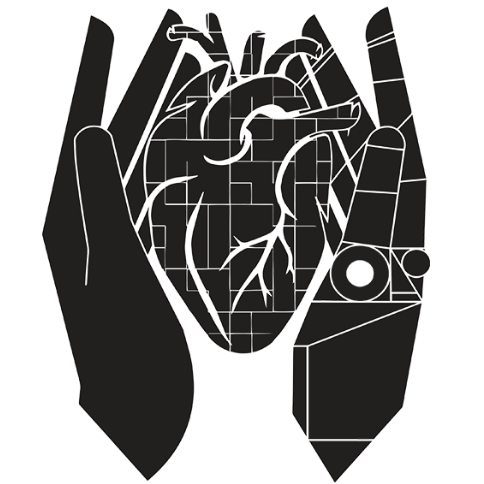

# Framework for Interactive Immersion into 3D Imaging Data (FI3D)

The FI3D is a framework that provides the tools for remote visualization of data. In particular, its use is highlighted when connected with augmented reality enabled devices to visualize data in true 3D. 

The framework has an emphasiz in medical applications. In other words, the tools are tailored towards medical imaging. However, the framework can be used for other types of visualization purposes.

The framework design was first published in the [Computer Methods and Programs in Biomedicine (CMPB) 2020](https://www.sciencedirect.com/science/article/abs/pii/S0169260720316126) which can be used as a citation if using the framework.

Despite its current uses, there are many features envisioned for the FI3D framework. Thus, it is currently marked as beta.

FI3D Beta Version: 1.0.0

Executables:
* [Windows 64-bit Beta v1.0.0](Builds/Windows_64-bit_FI3D_Beta_v1.0.0)
  * <b>Note:</b> This build includes the `Framework Interface (FI)` and `Demonstration (DEMO)` modules.

# Development Setup

The basic setup requires [CMake >3.13](https://cmake.org/download/), [Qt 5.14.2](https://www.qt.io/download), [VTK 8.2](https://vtk.org/download/), and the [vtkDICOM](https://github.com/dgobbi/vtk-dicom) package. Please refer to the appropriate guide to setting up the project.

* [Windows](Documentation/WindowsSetup.MD)
* [Mac](Documentation/MacSetup.MD)
* [Linux](Documentation/LinuxSetup.MD) (Tested on Ubuntu)

# FI3D Architecture

The FI3D is a framework that provides tools for remote control and visualization (with an emphasis on augmented reality devices). The framework features two key foundational self-contained applications: components and modules. Components are functionalities available to the entire FI3D. They adhere to the singleton pattern because only one instance of it may run throughout the execution of the application. These components are generally used as interfaces for peripherals, remote connections for data exchange, etc. Modules are applications with certain logic,  visualization, and manipulation. They have a GUI to be interacted with and many instances of the same module may be instantiated at the same time. Additionally, modules may use components for certain tasks. For example, a module which visualizes imaging data may use a component in charge of requesting data from a data base. Using these two, the system can separate services that are general and useful (components) to any module vs specific use cases (modules). 

## Generators

There are two generators provided to speed up the creation of components and modules. These are simple scripts that generate code. There will be a GUI to assist with these generators, but for now only the module generator is available as a Pythons script. To use, simply run the Python script located in the `Generators/ModuleGenerator` directory.

# FI3D Messaging Protocol

As mentioned in the [FI3D Architecture](#fi3d-architecture) section, FI3D can be accessed remotely by devices using a TCP connection. To control the system, one has to adhere to the messaging protocol designed. These messages have control of four key aspects of the system: authentication, application, data, and modules. To make a device interfaceable with the framework, implement the communication protocol described in the [Messaging Protocol](Documentation/FI3DMessagingProtocol/FI3DMessagingProtocol.MD) document.